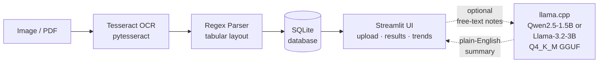

# Lab Report Structured Extractor

> **Hackathon Phase 1 — Planning Artifacts Only. Implementation starts in Phase 2.**

---

## Pitch

Diagnostic lab reports — CBCs, lipid profiles, thyroid panels, metabolic panels — arrive from dozens of different laboratories, each with its own paper layout, font, and column order. There is no standard digital format. Patients accumulate stacks of PDFs and photos with no practical way to compare a TSH value from six months ago to today's reading, let alone spot a creeping trend before it becomes a crisis. The tools that _do_ offer structured extraction almost universally require you to upload your blood-test results to a third-party cloud server — meaning your most sensitive medical data leaves your hands the moment you try to make sense of it. **Lab Report Structured Extractor** solves this by running the entire pipeline locally on your own machine: Tesseract OCR reads the scanned or photographed report, a deterministic regex parser maps every row into a structured record (test name · value · unit · reference range · H/L flag · date), and SQLite stores it so you can view trends over time — all with the network cable unplugged. An optional local LLM step (llama.cpp, quantized GGUF model) can translate a doctor's free-text impressions into plain English, again without a single byte leaving your device.

---

## CPU + Offline Declaration

*This section is required by hackathon rules. All inference and storage runs on CPU with no network calls in the core pipeline.*

| Component | Technology | Runtime |
|---|---|---|
| OCR Engine | **Tesseract 5.x** via `pytesseract` | CPU — runs offline |
| Structuring / Parsing | **Rule-based regex parser** (no ML model) | CPU — deterministic, no inference |
| Local LLM (doctor's notes summariser — optional) | **llama.cpp** with **Qwen2.5-1.5B-Instruct-Q4_K_M.gguf** or **Llama-3.2-3B-Instruct-Q4_K_M.gguf** | CPU — quantized GGUF, loaded from local disk |
| Database | **SQLite** (file on disk) | No server process |
| UI | **Streamlit** | Localhost only |
| Cloud APIs used | **None** | — |

> ⚠️ The `.gguf` model file must be downloaded once and placed at `models/` before first run. After that, the application operates fully offline.

---

## Architecture

```
┌─────────────────────────────────────────────────────────────────┐
│                         USER MACHINE                            │
│                                                                 │
│  ┌──────────────┐     ┌─────────────────┐     ┌─────────────┐  │
│  │  Image / PDF │────▶│  Tesseract OCR  │────▶│ Regex Parser│  │
│  │  (lab report)│     │  (pytesseract)  │     │  (tabular)  │  │
│  └──────────────┘     └─────────────────┘     └──────┬──────┘  │
│                                                       │         │
│                                              structured records  │
│                                                       │         │
│                                               ┌───────▼──────┐  │
│                                               │    SQLite    │  │
│                                               │   database   │  │
│                                               └───────┬──────┘  │
│                                                       │         │
│  ┌──────────────────────────────────────────┐        │         │
│  │           Streamlit UI                   │◀───────┘         │
│  │  (upload · view results · trend charts)  │                  │
│  └───────────────────┬──────────────────────┘                  │
│                      │  (optional: free-text doctor notes)      │
│                      ▼                                          │
│             ┌─────────────────┐                                 │
│             │   llama.cpp     │                                 │
│             │ Qwen2.5-1.5B /  │                                 │
│             │ Llama-3.2-3B    │                                 │
│             │  Q4_K_M GGUF    │                                 │
│             └─────────────────┘                                 │
│                                                                 │
│  🚫 NO network calls in core pipeline                           │
└─────────────────────────────────────────────────────────────────┘
```

Or as a Mermaid flowchart (renders on GitLab):



---

## Quickstart

> **Placeholder — commands will be filled in once Phase 2 implementation is complete.**

```bash
# 1. Clone the repo
git clone <repo-url>
cd lab-report-extractor

# 2. Create and activate a virtual environment
python -m venv .venv
source .venv/bin/activate          # Windows: .venv\Scripts\activate

# 3. Install dependencies
pip install -r requirements.txt

# 4. Install Tesseract (system dependency)
# Ubuntu/Debian: sudo apt install tesseract-ocr
# macOS:         brew install tesseract
# Windows:       installer from https://github.com/UB-Mannheim/tesseract/wiki

# 5. Download the quantized GGUF model (one-time, then offline forever)
# Place the file at: models/Qwen2.5-1.5B-Instruct-Q4_K_M.gguf
# Download link: <to be added>

# 6. Run (network can be disabled after model download)
streamlit run app.py
```

---

## License

This project is licensed under the **GNU Affero General Public License v3.0 (AGPLv3)**.
See [LICENSE](./LICENSE) for the full text.

The AGPLv3 was chosen deliberately: it requires any hosted (SaaS) deployment of this software to also release its source code, preventing a proprietary fork from being run as a cloud service — which would reintroduce the privacy problem this project is designed to solve.

---

## Contributing

See [CONTRIBUTING.md](./CONTRIBUTING.md) *(to be created in Phase 2)*.

## Changelog

See [CHANGELOG.md](./CHANGELOG.md) *(to be created in Phase 2)*.
