# Work Division & Implementation Schedule

This document outlines the allocation of components, tasks, and estimated times across the team. Since we are a multi-member team of three, we partition roles dynamically across the day to meet our Phase 2 and Phase 3 checkpoints.

## Team Roster

*   **Member A (Lead Developer):** [Member A]
    *   *Primary Focus:* OCR Extraction Engine, Regex Parser, SQLite Schema & DB Utilities.
*   **Member B (Frontend & Integration Developer):** [Member B]
    *   *Primary Focus:* Streamlit UI design, trend visualizations, data entry grids, SQLite-UI integrations.
*   **Member C (Inference & DevOps Engineer):** [Member C]
    *   *Primary Focus:* llama.cpp local runner integration, prompt engineering, CI/CD runner pipelines, pre-commit config, validation scripting.

---

## Task & Component Ownership Map

| Task ID | Component / Task | Lead Owner | Co-Developer / Reviewer | Estimate | Phase Target |
|---|---|---|---|---|---|
| **T1** | Local SQLite schema design & helper scripts | Member A | Member B | 1.5 hours | Phase 2 |
| **T2** | OCR Ingestion Pipeline (pytesseract wrapper & image preprocessing) | Member A | Member C | 2.5 hours | Phase 2 |
| **T3** | Regex Parser Engine & Flag Detection logic | Member A | Member C | 3.0 hours | Phase 2 |
| **T4** | Streamlit UI Mockup, Upload Widget & Interactive Grid | Member B | Member A | 2.0 hours | Phase 2 |
| **T5** | SQLite Integration into UI (saving reports + visual history list) | Member B | Member A | 2.0 hours | Phase 2 |
| **T6** | Analytics: Test Trend Charts & flag visualization component | Member B | Member C | 1.5 hours | Phase 2 |
| **T7** | llama.cpp Model loader & context window prompt wrapper | Member C | Member A | 2.5 hours | Phase 3 |
| **T8** | Comprehensive CI/CD checks integration (linters, security scan, pre-commits) | Member C | Member B | 2.0 hours | Phase 2 |
| **T9** | Standalone Offline E2E Validation Script (for network-off tests) | Member C | Member A | 1.5 hours | Phase 3 |
| **T10**| Phase 3 final polish, demo video preparation, and documentation | All | All | 2.0 hours | Phase 3 |

---

## Milestone Sequence (Today's Timeline)

```mermaid
gantt
    title Hackathon Implementation Flow
    dateFormat  HH:mm
    axisFormat  %H:%M
    section Phase 1 (Planning)
    Artifact Creation & Issuing :active, 09:30, 10:15
    section Phase 2 (Core Build)
    DB Schema & OCR Setup (T1, T2) : 10:15, 12:00
    Regex Parser Core (T3) : 12:00, 14:00
    Streamlit Dashboard & Visuals (T4, T5, T6) : 10:15, 14:00
    CI/CD Pipelines (T8) : 12:00, 14:00
    section Phase 3 (LLM & E2E)
    llama.cpp Integration (T7) : 14:00, 15:30
    Network-off Test Script (T9) : 14:00, 15:00
    Review, Polish & Video Demo (T10) : 15:30, 17:00
```

*   **Phase 1 Deadline (10:00 AM):** Planning artifacts (README, SPEC, WORK-DIVISION, LICENSE, issue setup) finalized and pushed.
*   **Phase 2 Deadline (3:00 PM):** Main extraction pipeline, database integration, trend visualizations, linting checkers, and CI/CD pipelines fully operating locally.
*   **Phase 3 Deadline (5:00 PM):** llama.cpp summary pipeline, offline test runner validation, and presentation video completed.
